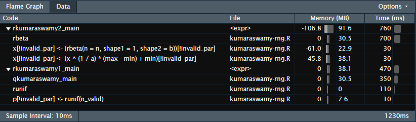
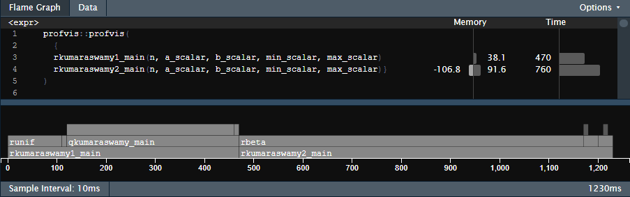

```{r setup, include=FALSE}
knitr::opts_chunk$set(echo = TRUE)
# library(bench)
# # load("benchmark_results.RData")
# source("kumaraswamy-rng.R")
# bench_input_checking_scalar <- readRDS("bench_input_checking_scalar.rds")
```

In this file the two rng-functions for the kumaraswamy distribution are 
profiled:

\begin{itemize}
\item rkumaraswamy1: inverse transform sampling, utilizing runif(0,1)
\item rkumaraswamy2: sampling from rbeta(1, b) and calculating $x^{1/a}$
\end{itemize}

The mark function from the bench package was used to benchmark the functions. 
The profvis function from the provis package was used to profile the functions. 

The input checking and the 'actual calculations', i.e. the rkumaraswamy1_main
and rkumaraswamy2_main, are benchmarked separately. 
As both rng-functions use the same input-checking, there is no point in 
comparing them. 

# Benchmarking

One thing to notice is that the mean and the max of the runtime are not 
included intentionally. The reason is that the benchmarking process can be 
interrupted by other programs. Therefore some runtimes are higher than they 
would be without these interruptions. This makes the mean and the max 
less informative. 

## Benchmarking the input checking 

The input checking is benchmarked separately for scalar parameters and for
zed iparameters. For both $n$ was set to $1e5$

For the scalar input checking the following values were chosen: 

$a = 0.5, \quad b = 0.3, \quad \min = -1, \quad \max = 2$

For the vectorized input checking 100 values from a standard normal were 
generated for each of the parameters $a, b, \min, \max$  (naturally before
the benchmarking). 

The results are summarized in the following table: 

\begin{center}
\begin{tabular}{ |c|c|c|c|c|c|c|c|c| } 
\hline
 input & min & median & $\text{itr/sec}$ & $\text{mem\_alloc}$ & 
 $\text{gc/sec}$ & $\text{n\_itr}$ & $\text{n\_gc}$ & $\text{total\_time}$ \\ 
\hline
 scalar & $205 \mu s$ & $242 \mu s$ & $3405$ & $172KB$ & $8.47$ & $1609$ & $4$ & $473 ms$  \\ 
 vectorized & $6.04 ms$ & $8.69 ms$ & $89.52$ & $8.78 MB$ & $39.39$ & $25$ & $11$ & $279 ms$ \\
\hline
\end{tabular}
\end{center}

The important point to take away from this table is that the time, required to 
check the inputs, as well as the memory usage is negligible. 
(One side note is that the input checking for a scalar parameter does not 
scale with $n$ but for vectorized parameters it does because of the recycling.)

## Benchmarking the 'actual calculations'

The following table compares the two functions: rkumaraswamy1_main and 
rkumaraswamy2_main. 
As the results for vectorized parameters and scalar parameters are similar, only
the result for scalar parameters is provided. $n$ was again set to 100 000.

\begin{center}
\begin{tabular}{ |c|c|c|c|c|c|c|c|c| } 
\hline
 function & min & median & $\text{itr/sec}$ & $\text{mem\_alloc}$ & 
 $\text{gc/sec}$ & $\text{n\_itr}$ & $\text{n\_gc}$ & $\text{total\_time}$ \\ 
\hline
 rkumaraswamy1 & $20.9 ms$ & $23 ms$ & $41.23$ & $3.54 MB$ & $14.73$ & $14$ & $5$ & $340 ms$  \\ 
 rkumaraswamy2 & $34 ms$ & $35.4 ms$ & $26.51$ & $5.5 MB$ & $4.82$ & $11$ & $2$ & $415 ms$ \\
\hline
\end{tabular}
\end{center}

The first implementation outperforms the second version. 
This is not really surprising however, as Wikipedia
states that 

"It (Kumaraswamy distribution) is similar to the Beta distribution, 
but mich simpler to use especially in simulation studies since its probability
density function, cumulative distribution function and quantile functions can 
be expressed in closed form." 

# Profiling

Only rkumaraswamy1_main and rkumaraswamy2_main are profiled, as they are in the
main interest. $n$ was set to $2e6$.






The results confirm that indeed the generation of pseudo-random numbers from the
beta distribution is the bottleneck in rkumaraswamy2_main and the reason 
why it is so much slower than the first version. In the paper, on the basis of 
which the rbeta function was programmed (see the help-page of rbeta), it says
that it is based on a rejection method. This explains, why it is so much slower
compared to runif. Not only does it have to sample twice: once from the 
proposal and once from the uniform distrbution, the number of times it has to
samle from these distributions is potentially much higher than $n$ if the 
rejection rate is high. This naturally also explains the far higher memory
usage, as more samples are generated during the runtime. 

For the rkumaraswamy2_main function, the most costly operation is the 
quantile function. Even though it is analytically calculable, it still requires
9 vectorized operations to calculate the quantiles for the values generated 
by runif. 
